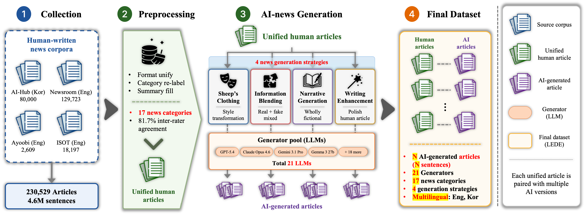

# 💡 LEDE : A large-scale benchmark for AI-generated news detection

<br> 
<p align="center">
  
  <br>
  <b>[AI-generated news construction pipeline]</b>
</p>

 
<br>
LEDE is a large-scale, AI-generated news detection benchmark dataset comprising 300K articles and approximately 4M sentences.It addresses the limitations of existing benchmarks by providing broader generator diversity and news-specific coverage across 21 state-of-the-art LLMs, two languages, and 17 news categories. This makes LEDE an invaluable resource for advancing AI-generated text detection research, with the dataset publicly available for future studies. You can find LEDE's AI-generated articles in the dataset repository. It includes samples spanning multiple generation strategies and news categories. For access to the entire dataset, please refer to the link above. [link to be added]
<br>
<br>


## 💡 Quantitative comparison of LEDE and existing AI-Gen News datasets  

| Dataset | Venue | Including News | # News | # LLMs | # Category | # Language |
|---|---|---|---:|---:|---:|---:|
| M4 [[paper]](https://aclanthology.org/2024.eacl-long.83/?utm_source=thedeepview&utm_medium=newsletter&utm_campaign=the-ftc-s-ai-crackdown) | EACL 2024 | ✓ (N%) | 12,000 | 2 | ✗ | 3 |
| MAGE [[paper]](https://aclanthology.org/2024.acl-long.3/) | ACL 2024 | ✓ (N%) | 58,391 | 27 | ✗ | 1 |
| M4GT-Bench [[paper]](https://aclanthology.org/2024.acl-long.218/) | ACL 2024 | ✓ (N%) | 19,100 | 4 | ✗ | 6 |
| RAID [[paper]](https://aclanthology.org/2024.acl-long.674/) | ACL 2024 | ✓ (N%) | 726,240 | 11 | 5 | 1 |
| DetectRL [[paper]](https://dl.acm.org/doi/10.5555/3737916.3741102) | NeurIPS 2024 D\&B | ✓ (N%) | 33,600 | 4 | ✗ | 1 |
| Beemo [[paper]](https://aclanthology.org/2025.naacl-long.357/) | NAACL 2025 | ✗ | -- | -- | -- | -- |
| M-DAIGT [[paper]](https://aclanthology.org/2025.ranlp-mdaigt.1/) | RANLP 2025 Shared Task | ✓ (N%) | 7,000 | 6 | ✗ | 2 |
| **LEDE** | -- | **✓ (100%)** | **337,322** | **21** | **17** | **2** |

---
<br>


## 💡 Data Description

LEDE is a large-scale multilingual benchmark for AI-generated news detection, designed to support robust evaluation across diverse LLMs, news categories, generation strategies, and languages.

### 📈 LEDE Dataset Statistics

#### AI-generated News
  - \# of LLMs : **21**
  - \# of Languages : **2 (Eng, Kor)**
  - \# of Articles : **337,322**
  - \# of Sentences : **4,309,153**
  - \# of News Category : **17**
  - \# of News Strategy : **4 (sc, ib, ng, we)** 
  - \# English Sentences : **2,393,518**
  - \# Korean Sentences : **1,915,635**

 
### 📑 Configuration of **LEDE** Metadata 

| Field | Description |
|---|---|
| `human_rid` | Identifier for the original human-written article. <br> • AIHub datasets: uses the official AIHub dataset ID <br> • English datasets: constructed as `{first 4 words}-{last 4 words}` from the original article |
| `human_fid` | Identifier for the corresponding fake/generated counterpart. <br> • AIHub datasets: uses the official AIHub dataset ID <br> • English datasets: constructed as `{first 4 words}-{last 4 words}` from the original article |
| `title` | Title of the AI-generated news article |
| `summary` | Summary of the AI-generated news article |
| `ai_article` | Full text of the AI-generated news article |
| `category` | News category/domain of the article (17 categories in total; e.g., politics, health, law, economy, sports) |
| `model` | Large Language Model (LLM) used for article generation (21 models in total) |
| `strategy` | Generation strategy used for article creation (sc, ib, ng, we)|
| `language` | Language of the generated article (Kor or Engs) |
| `num_sentences` | Number of sentences in the generated article |
| `num_words` | Number of words in the generated article |

<br>


## 💡 Evaluation

### 1. Data preparation 
#### 1.1. Download LEDE Datasets
To access the LEDE dataset, please visit the following link.

[ Hugging face url to be added]


The LEDE dataset is available under the [Creative Commons Attribution-NonCommercial 4.0 International Public License](https://creativecommons.org/licenses/by-nc/4.0/). Any violation of this license agreement may result in legal action. By downloading the HiDF, the user agrees to the terms of the CC BY-NC 4.0 license.

#### 1.2. Download Human-written News Datasets
Please download all of the following datasets and store them in the human-written/ directory.
- [AI-Hub Dataset](https://aihub.or.kr/aihubdata/data/view.do?currMenu=115&topMenu=100&aihubDataSe=data&dataSetSn=97)
- [Newsroom Dataset](https://huggingface.co/datasets/lil-lab/newsroom) 
- Ayoobi Dataset (link to be added)
- [ISOT Fake News Dataset](https://www.kaggle.com/datasets/rahulogoel/isot-fake-news-dataset)

#### 1.3.Mapping Human-written News
Each human-written article is aligned with its corresponding AI-generated article using the human_rid field.

- **AI-Hub datasets**: The original dataset ID is used directly.
- **English datasets**: IDs are constructed in the format {first 4 words}-{last 4 words} from the original article.

This mapping enables direct and consistent comparison between human-written and AI-generated texts during evaluation.

<br>

### 2. Baseline Evaluation
Run baseline model evaluation using either a single CSV file or a CSV directory.
Below are sample commands for running zero-shot baseline evaluations.

```
$ git clone https://github.com/DSAIL-SKKU/LEDE.git
```

#### 2-1. [Fast-DetectGPT](https://github.com/baoguangsheng/fast-detect-gpt)


Installation
- You can follow the official Fast-DetectGPT GitHub repository for installation details.
- Python3.8
- PyTorch1.10.0


Evaluate a CSV Directory
```shell
$ cd src/baselines/fast-detect-gpt
$ bash scripts/eval.sh --csv_dir /path/to/csv_dir
```

Each file prints metrics in the following format:
```text
n_pairs: XXXX
ROC AUC (criterion): 0.XXXX
PR AUC (criterion): 0.XXXX
```

The aggregated per-file metrics are saved to `./outputs/batch_eval/roc/` by default.


#### 2-2. [Binoculars](https://github.com/ahans30/Binoculars)

Installation
- You can follow the official Binoculars GitHub repository for installation details.
- Python3.8
- PyTorch1.10.0

Evaluate a Single CSV File
```shell
$ cd src/baselines/Binoculars/
$ bash eval.sh --csv_path /path/to/file.csv
```

Evaluate a CSV Directory
```shell
$ cd src/baselines/Binoculars/
$ bash eval.sh --csv_dir /path/to/csv_dir
```

Each file prints metrics in the following format:
```text
[OK] <file>.csv | n=<rows> (eval=<evaluated_rows>) | ACC=0.XXXX ROC_AUC=0.XXXX PR_AUC=0.XXXX
```

The aggregated per-file metrics are saved to `binoculars_csv_folder_metrics.csv` by default.


### 2-3. Additional Models

In addition to the two base models described above, other AI-generated text detection models can be explored through their official GitHub repositories.

Zero-shot Modles
- [DetectGPT (2023)](https://github.com/eric-mitchell/detect-gpt)
- [Fast-DetectGPT (2024)](https://github.com/baoguangsheng/fast-detect-gpt)
- [Binoculars (2024)](https://github.com/ahans30/Binoculars?tab=readme-ov-file)
- [AdaDetectGPT (2025)](https://github.com/Mamba413/AdaDetectGPT)

Supervised Models
- [RoBERTa (2019)](https://github.com/facebookresearch/fairseq/blob/main/examples/roberta)
- [DeBERTa (2023)](https://github.com/microsoft/deberta)
- [RADAR (2023)](https://github.com/IBM/RADAR)
- [DeTeCtive (2024)](https://github.com/heyongxin233/DeTeCtive)
- [Easy2Hard (2025)](https://github.com/tmlr-group/Easy2Hard)


<br>

## 💡 Maintenance
This repository is maintained by [Chaewon Kang](https://sites.google.com/view/chaewon-kang/) and Seoyoon Jeong. Any feedback, extensions & suggestions are welcome! Please send an email to codnjs3@g.skku.edu.
<br>

## 💡 License
The HiDF dataset is available under the Creative Commons Attribution-NonCommercial 4.0 International Public License: [https://creativecommons.org/licenses/by-nc/4.0/](https://creativecommons.org/licenses/by-nc/4.0/). The code is released under the MIT license.